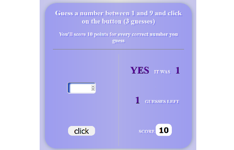
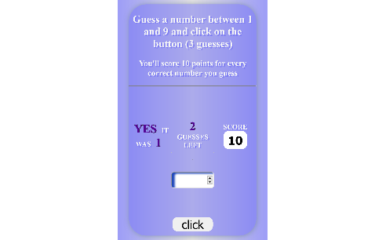

   # Number Guesser

   ## Vezba Pogadjanja Brojeva 

  
 * _This is a simple game where the goal is to guess a number between 1 and 9._
 * _You have right on 3 guesses, and for each correct guess you get 10 points._
 * _Technologies that were used on this project are: HTML, CSS and Vanilla JavaScript._
 * _It's design is responsive which means that it's content gets rearranged for smaller screens._

 
 * This is a photo of a game in progress (for desktop screen size).
 
   

 
 * This is a photo of a game in progress (for smaller screen size).
 
  

 
 
 > (Just a note that on the other branch "zadatakUTriDela"
 > is an older (beginner's) version of this project that is outdated.)

